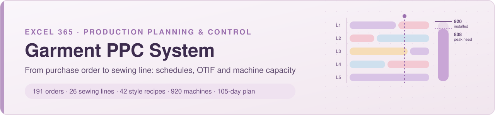
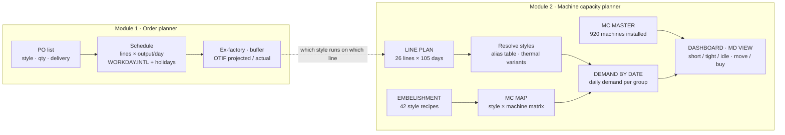
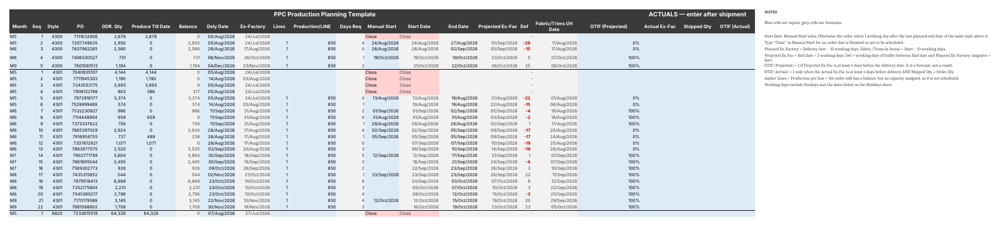
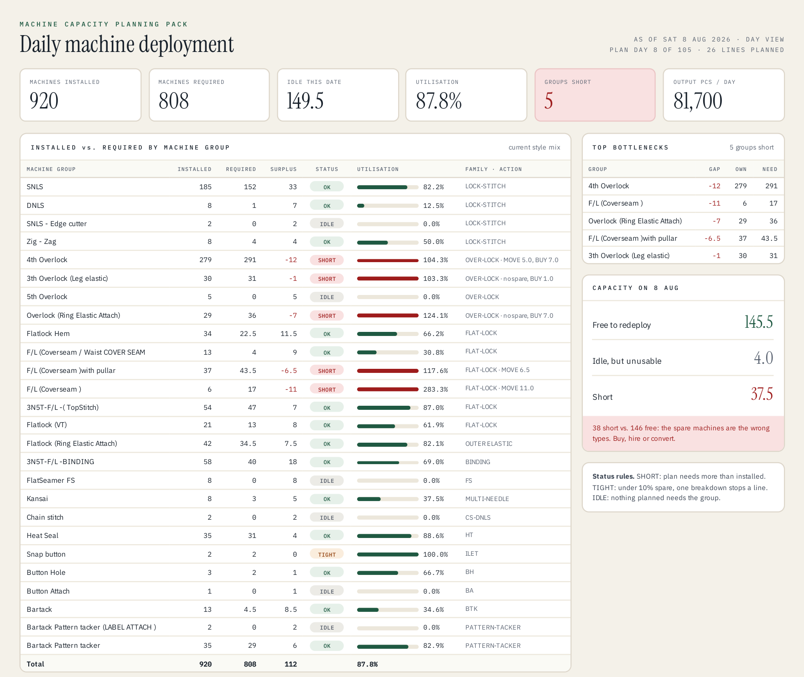
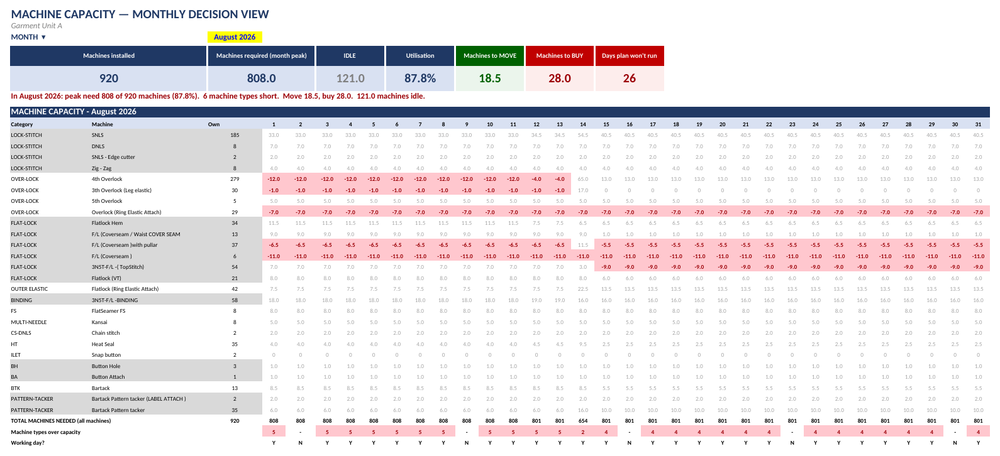
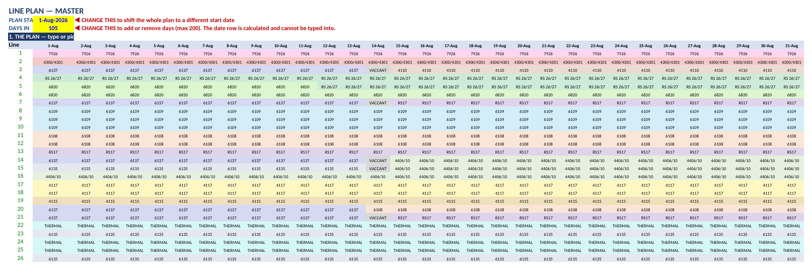
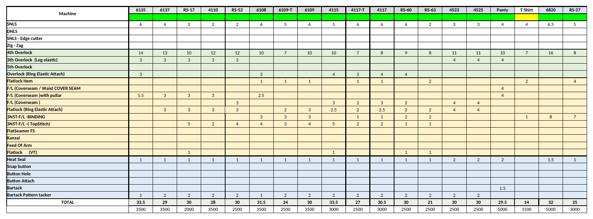

<p align="center">

</p>

<p align="center">


</p>

<p align="center">
<a href="#overview">Overview</a> ·
<a href="#module-1--order-planner">Order planner</a> ·
<a href="#module-2--machine-capacity-planner">Capacity planner</a> ·
<a href="#validation">Validation</a> ·
<a href="#review-and-fixes">Fixes</a> ·
<a href="#repository-structure">Structure</a>
</p>

---

## Overview

A two-module **Production Planning & Control (PPC)** system I designed and built in Excel 365 for a garment manufacturing unit (innerwear, thermals, T-shirts, polos). It answers the two questions a PPC desk faces every week:

1. **Will each purchase order ship on time?** *Order planner:* schedules every PO onto sewing lines on a working-day calendar and projects ex-factory dates and OTIF.
2. **Do we have the machines to run the line plan?** *Machine capacity planner:* turns a 26-line × 105-day style plan into daily machine demand for 26 machine groups and compares it with the 920 machines installed.

> **The data in this repository is anonymised.** The company name, buyer PO numbers, style codes, machine brands and models have been masked. Order quantities have been rescaled. Dates, the plan grid, machine recipes and counts, every formula, and every result that does not depend on a name are identical to the working files. See [Anonymisation](#anonymisation).

| | Order planner | Machine capacity planner |
|---|---|---|
| **Unit of planning** | Purchase order | Sewing line × day |
| **Scope (sample)** | 191 POs · 25 styles · Jul–Dec 2026 deliveries | 26 lines · 105-day horizon · 42 style recipes · 26 machine groups |
| **Core logic** | `WORKDAY.INTL` scheduling with style chaining and manual overrides | Style recipe × line plan → daily demand per machine group vs installed |
| **Outputs** | Start / end / ex-factory dates, buffer days, fabric in-house date, OTIF (projected and actual) | Day and month dashboards, bottlenecks, machines to move or buy, peak demand |
| **File** | [`PPC_Order_Planner_SAMPLE.xlsx`](workbooks/PPC_Order_Planner_SAMPLE.xlsx) | [`PPC_Machine_Capacity_Planner_SAMPLE.xlsx`](workbooks/PPC_Machine_Capacity_Planner_SAMPLE.xlsx) |



---

## Module 1 · Order planner



Each row is one PO. The planner types the style, PO, quantity, delivery date, lines and output per line. Everything else is calculated:

| Step | Rule |
|---|---|
| Balance | Order qty − produced to date |
| Days required | `ROUNDUP(balance / (lines × output per line))` |
| **Start date** | Manual start if typed, otherwise **1 working day after the last planned end date of the same style above** (`LOOKUP(2,1/…)` chaining). Type `Close` to park an order |
| End date | Start + days required, in working days |
| Planned ex-factory | Delivery − 10 working days |
| Projected ex-factory | End + 3 working days (finishing and packing) |
| Buffer (`Def`) | Working days between end date and planned ex-factory. **Negative = late** (red) |
| Fabric / trims in-house | Start − 10 working days |
| OTIF (projected) | 1 if projected ex-factory is at least 4 days before delivery |
| **OTIF (actual)** | 1 only when the actual ex-factory date meets that rule **and** shipped qty ≥ order qty |

Working days exclude Sundays and the holiday register on the `Holidays` sheet, which also builds an annual working calendar for the year typed in `B2`.

Full column reference: [`docs/order-planner.md`](docs/order-planner.md)

---

## Module 2 · Machine capacity planner



**How it works.** Every line runs one style per day, and every style has a fixed machine recipe. So the machines needed on any day are the sum of 26 recipes. That sum is compared with the installed count group by group, because machines are not interchangeable across groups. A plan can need fewer machines in total than the factory owns and still be impossible to run.

| Sheet | Role |
|---|---|
| `LINE PLAN` | The plan: one style per line per date, picked from a validated dropdown and coloured by conditional formatting. Two control cells set the start date and horizon (up to 200 days). A resolved grid expands `THERMAL` into its named variant |
| `EMBELISHMENT` | Machine recipe per style: 25 operations × 42 styles, plus output per day |
| `MC MASTER` | Installed machines by group. **This sheet is the capacity** |
| `MC MAP` | The workshop: operation → machine group, the alias table (planner's text → recipe), the **style × machine matrix** with a cross-foot check, and line loading for the selected date |
| `DEMAND BY DATE` *(hidden)* | The daily engine: counts lines per style per day, multiplies by the matrix, and flags groups over capacity. Also holds the working calendar |
| `DASHBOARD` | Day view (or month-end / month-peak view): installed vs required, status per group (SHORT / TIGHT / IDLE / OK), top bottlenecks, idle capacity, line loading |
| `MD VIEW` | Monthly decision view for management: peak need, machines to **move** (within a category) and to **buy**, days the plan can't run |
| `GUIDE` | Built-in user manual: input cells, routines, self-checks, known gaps |



<details>
<summary>More screenshots: line plan and style recipes</summary>




</details>

**Built-in safeguards**

- **Locked sheets:** every sheet is protected and only the input cells accept typing. Sorting and inserting rows are blocked, because sorting the plan grid would scramble the references behind it.
- **Pricing check:** `LINE PLAN!HA2` turns red and counts the cells that use a style with no machine recipe. Those cells would otherwise cost zero machines.
- **Matrix cross-foot:** `MC MAP!AD33:AD80` checks that each style's re-grouped machine total equals its recipe total.
- **Daily flags:** a thermal-variant-not-named flag and a groups-over-capacity count for every day.

Full sheet and formula reference: [`docs/capacity-planner.md`](docs/capacity-planner.md)

---

## Validation

| Check | Result |
|---|---|
| Independent recalculation (LibreOffice) vs Excel's own results, original files | 42,782 formula cells compared. All match except 7 cells with known engine differences (`WEEKNUM` at year end, `@` implicit intersection, blank-cell handling in `INDEX`), which keep Excel's values |
| Fixed workbooks vs originals | Every scheduled date, buffer, OTIF flag and machine number is unchanged. The only intended difference is the corrected dashboard header |
| Anonymised vs fixed | All 38,978 formula results in the capacity planner are identical, or differ only by the masked style name. All dates and days required in the order planner are identical |
| Capacity planner self-checks | Pricing check green · 46 / 46 matrix rows `OK` (2 `n/a`) · zero formula errors |
| Leak scan | No company name, PO number, original style code, brand, model or author name left in any part of either file |

**Plan findings (sample):**

- Peak demand is 808 machines against 920 installed (87.8% utilisation).
- The plan still **cannot run on 65 of its 71 planned working days**, because 4th overlock, coverseam and ring-elastic overlock groups are short.
- In the order planner, 77 of 129 scheduled orders finish after their planned ex-factory date.

---

## Review and fixes

I reviewed both workbooks before publishing and fixed what could be fixed without changing the plan. Details and verification are in [`docs/fix-log.md`](docs/fix-log.md).

| # | Issue found | Fix |
|---|---|---|
| 1 | Start Date formula overwritten with typed values in 163 of 191 rows, so new orders no longer chained | Formula restored in every row. The 151 typed dates and `Close` flags moved into **Manual Start**, so the plan is unchanged |
| 2 | "OTIF" used a *projected* ex-factory date and ignored quantity | Renamed to **OTIF (Projected)**. Added **Actual Ex-Fac**, **Shipped Qty** and **OTIF (Actual)** (on time *and* in full) |
| 3 | 18 open orders had no lines or output assigned, so they were silently unscheduled | Highlighted amber with a rule |
| 4 | "Close" highlight depended on whatever value happened to sit in cell `O8` | Rule now tests for the text `Close` |
| 5 | GUIDE pointed at old cells (`DJ2`, column `DN`, column `DI`) | Corrected to `HA2`, `HE5:HE47`, `GY36:GY61` |
| 6 | Month views hard-coded to Aug–Nov 2026. Moving the plan start broke 502 formulas, and January would have counted blank days | Month list now follows the plan start date (tested with a 10-Nov start: 502 errors → none, once a new as-of date is picked) |
| 7 | Dashboard date / view / month pickers had no dropdowns, although the notes said they did | Dropdowns added |
| 8 | Bottleneck header showed the utilisation % ("TOP 6 BOTTLENECKS OF 0.878…") instead of the number of short groups | Points to the short-group count |
| 9 | Style codes are written differently in the two modules (`RS26` vs `RS 26/27`, `4406P` vs `4406/10`), and one ordered style (`TH07`) has no machine recipe | Documented in a crosswalk ([`docs/fix-log.md`](docs/fix-log.md#style-crosswalk)). A shared style master is the next step |

---

## Anonymisation

The public files were produced from the fixed workbooks by an XML-level script, so formulas, conditional formatting, data validation, comments, charts and sheet protection are untouched:

- **Company:** the name is replaced with *Garment Unit A*, including headers, footers and formula text.
- **Style codes:** replaced with substitute codes, applied consistently across both workbooks, so paired and variant styles keep their relationship.
- **POs and quantities:** PO numbers are replaced. Order quantities and output per line are scaled by the same factor, so days required and every date are unchanged.
- **Machine register:** brands and model numbers in the archived asset register are generalised.
- **Removed:** document authors, printer settings and add-in task panes.

Dates, machine counts, recipes and the plan grid are real.

---

## Repository structure

```
├── README.md
├── workbooks/
│   ├── PPC_Order_Planner_SAMPLE.xlsx             # Module 1
│   └── PPC_Machine_Capacity_Planner_SAMPLE.xlsx  # Module 2
├── docs/
│   ├── order-planner.md       # column reference and scheduling logic
│   ├── capacity-planner.md    # sheet map, data flow, key formulas, self-checks
│   └── fix-log.md             # review findings, fixes, verification, style crosswalk
└── images/
```

Screenshots are rendered from the sample files in LibreOffice.

---

**Author:** Tanmay Mandal, Business Analysis · Operations · ERP
© Tanmay Mandal. All rights reserved. Shared for portfolio viewing only.
